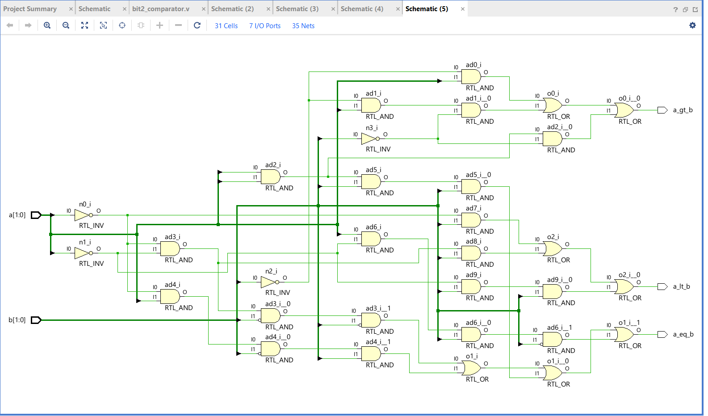

## Half Adder — 13 Aug 2026
- Built using gate primitives (XOR, AND)
- Elaborated in Vivado and verified the schematic
- RTL_XOR drives sum, RTL_AND drives carry — as expected
- Testbench pending; will add after covering it in class

## Full Adder — 13 Aug 2026
- Built using gate primitives: a 3-input XOR drives sum, three ANDs feed a 3-input OR to drive carry
- Declared internal wires w1, w2, w3 to hold the partial carry terms
- Verified the elaborated schematic in Vivado — gate count and connections matched the hand-drawn design
- Learned that internal wires are declared in the module body, not in the port list, since they are local to the module and not part of its interface

## Full Adder using Half Adders — 13 Aug 2026
- Built the same full adder hierarchically by instantiating two half_adder modules instead of using flat gate primitives
- ha1 adds a and b; ha2 adds that partial sum with cin; an OR gate combines the two carry outputs
- Used by-name port connections (.a(w1)) so the mapping stays correct even if the port order changes later
- Compared the schematic with the flat gate version — same logic, but this one shows two half_adder blocks instead of individual gates, which is how hierarchy appears in RTL

## Half Subtractor — 13 Aug 2026
- Difference uses the same XOR as the half adder's sum, since a XOR b is identical for both operations
- Borrow needed an inverter: borrow = (NOT a) AND b, whereas the half adder's carry was simply a AND b
- Declared wire w1 to carry the inverted a signal from the NOT gate into the AND gate
- Verified the elaborated schematic in Vivado

## Full Subtractor — 13 Aug 2026
- Wrote this one without referring to a solution — derived the gate structure from the circuit diagram
- Difference chains two XORs: x1 gives a XOR b, then x2 combines that with bin
- Borrow needs two AND terms, each with an inverted input, combined by an OR
- Used five wires: w1 branches to both x2 and n1, which is a single net driving two loads rather than two separate signals
- Vivado's elaborated schematic showed only five cells — it absorbed both NOT gates into the AND inputs as inversion bubbles, an optimisation that keeps the logic identical

## 4-bit Ripple Carry Adder — 14 Aug 2026
- Reused the existing full_adder module by instantiating it four times instead of writing four separate modules
- First use of vector ports: [3:0] declares a four-bit bus, and individual bits are accessed as a_rca[0], a_rca[1] and so on
- Chained the carry through internal wires w0, w1, w2 — each stage's carry output becomes the next stage's cin, which is where the "ripple" name comes from
- Only the first stage's cin and the last stage's carry connect to ports; everything in between needs internal wires
- Hit a bug where the vector width carried over to the next port in the list, making cin_rca and cout_rca four bits wide — spotted it in the schematic from the [3:0] labels and a ground symbol on the unconnected bits. Fixed by declaring each port with its own direction keyword and width
- Learned to verify a schematic by checking port widths, cell count, and looking for unconnected or grounded nets

## BCD Adder — 15 Aug 2026
Built a single-digit BCD adder by instantiating the ripple carry adder module twice, with detection logic in between.

**How it works**
- rca1 performs plain binary addition of a_bcd and b_bcd, producing sum_temp and cout_temp
- Detection logic decides whether the result is a valid BCD digit (0 to 9) or needs correcting
- rca2 adds 6 when correction is needed, or 0 when it is not
- Maximum possible input is 9 + 9 + carry = 19, so the design must handle results from 0 to 19

**Detection logic — two separate conditions**
- Sums 10 to 15 are caught by their bit patterns: sum_temp[3] AND sum_temp[2], or sum_temp[3] AND sum_temp[1]
- Sums 16 to 19 overflow the 4-bit output, so their binary sum reads as 0 to 3 and the AND gates miss them entirely; cout_temp catches these
- All three conditions feed one OR gate

**The correction value trick**
- 6 in binary is 0110 and 0 is 0000, so bit 3 and bit 0 are always zero while bit 2 and bit 1 exactly track the correction signal
- Wiring the OR gate output into bit 2 and bit 1 produces 0110 or 0000 automatically, with no multiplexer needed

**Mistakes I made and fixed**
- Left cout_temp out of the OR gate at first — this silently breaks every case from 16 to 19. Traced it with 8 + 9: the binary sum is 17, sum_temp reads 0001 and the AND gates both output 0, so no correction fired and the answer came out as 1 instead of 17
- Connected the final carry to rca2's cout instead of the OR gate output. The BCD carry is the correction signal itself, not the second adder's carry — rca2's cout is left unconnected
- Wrote the instance name as ripple_carry_adder when the module is actually named Ripple_carryadder; Verilog is case-sensitive, so the mismatch failed elaboration
- Tried indexing 4-bit signals when connecting to 4-bit ports (a_rca[0] instead of a_rca). Indexing is only needed when the port is narrower than the signal, as when a 1-bit full adder port takes one bit of a 4-bit bus

**Doubts I worked through**
- Why sum_bcd is an output when the inner adders also have sums: each module has its own boundary, and only signals crossing the bcd_adder boundary are ports. The first adder's sum stays inside as a wire
- Why b_bcd does not appear in the second adder: its job finishes in rca1. The second adder's b input carries the correction value, not the original operand
- Why one wire can serve two purposes: the OR gate output is both the final carry and the correction control, because the condition for a BCD carry and the condition for correction are identical
- When to use assign versus gate instantiation: assign for constants, wire-to-wire connections and expressions; gate instantiation when a specific gate primitive is wanted

![BCD Adder Schematic](06_bcd_adder/bcd_adder_schematic.png

## 2-bit Comparator — 16 Aug 2026
Built a 2-bit magnitude comparator with three outputs, derived directly from the truth table rather than from a reference design.

**Structure**
- Sixteen input combinations across a[1:0] and b[1:0], grouped into three outputs
- Greater-than and less-than each need three product terms; equality needs four, one for each matching pair
- Four inverters supply the complements of both operands' bits

**Mistakes I made and fixed**
- All four inverters were driven from operand a, with none generating b's complements, even though the product terms below assumed nt[2] and nt[3] were b's inverses. This single error corrupted every term that referenced them
- Two AND gates were given the same output net name, so the second product term for greater-than had nowhere to go
- One equality term used b[0] where its complement belonged, so the 00 = 00 case never asserted

**What I learned**
- Vivado splits multi-input gate primitives into two-input cells during elaboration, so the schematic showed thirty-one cells for seventeen gates written in source. Cell count alone is not a way to verify a design
- Reading a hand-drawn gate diagram is error-prone; deriving terms from the truth table directly is more reliable and easier to check

