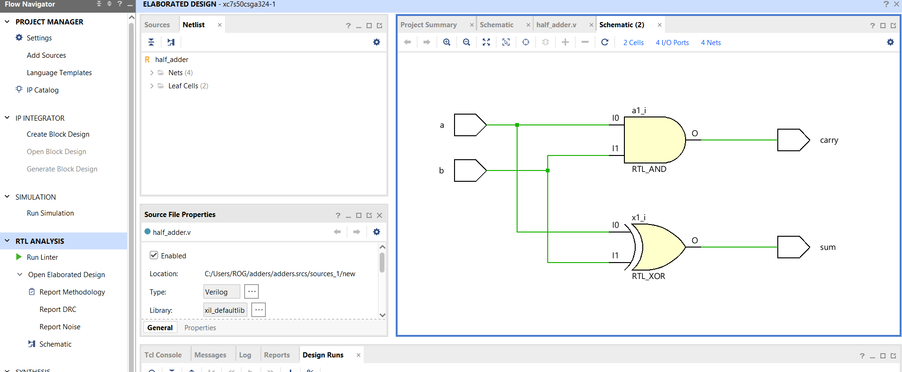
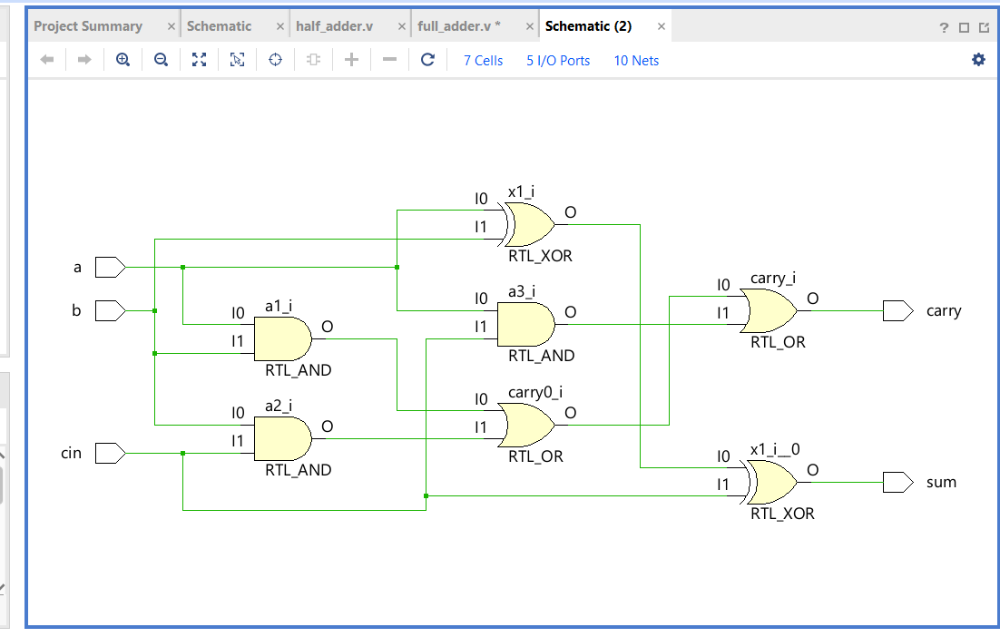
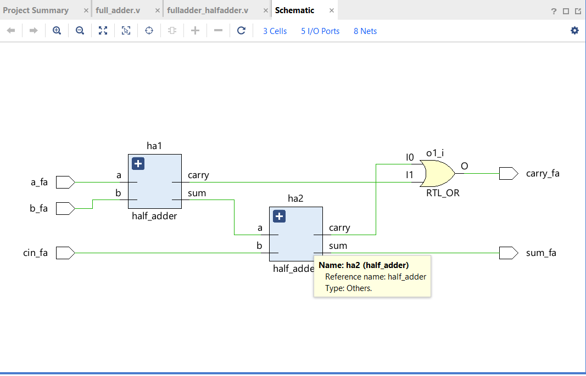
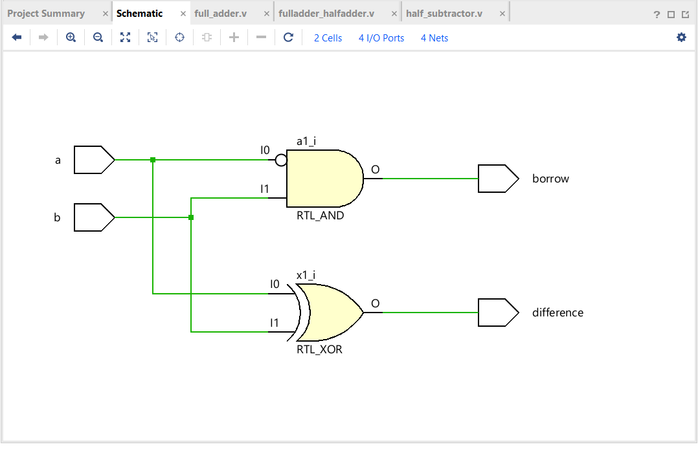
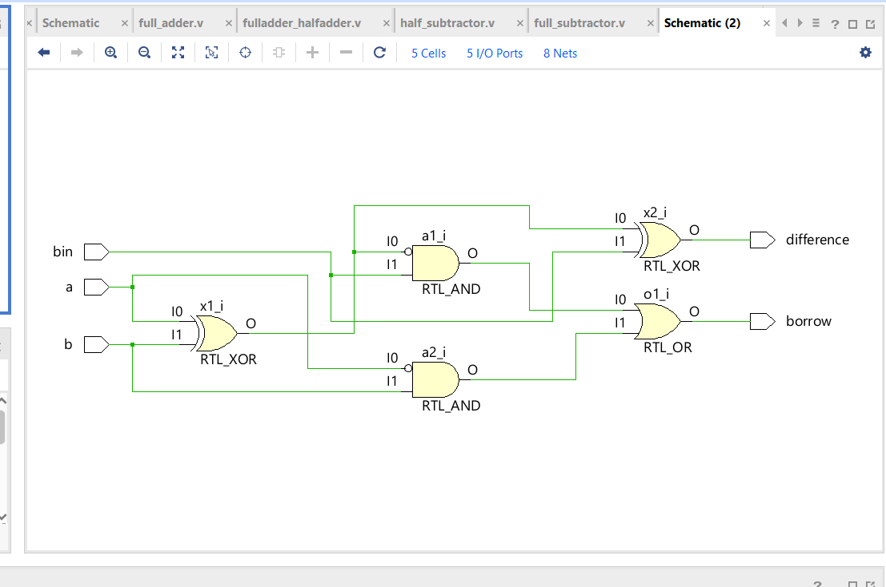
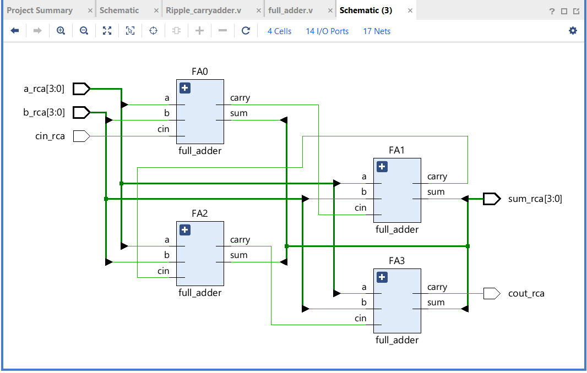

## Half Adder — 13 Aug 2026
- Built using gate primitives (XOR, AND)
- Elaborated in Vivado and verified the schematic
- RTL_XOR drives sum, RTL_AND drives carry — as expected
- Testbench pending; will add after covering it in class

## Full Adder — 13 Aug 2026
- Built using gate primitives: a 3-input XOR drives sum, three ANDs feed a 3-input OR to drive carry
- Declared internal wires w1, w2, w3 to hold the partial carry terms
- Verified the elaborated schematic in Vivado — gate count and connections matched the hand-drawn design
- Learned that internal wires are declared in the module body, not in the port list, since they are local to the module and not part of its interface

## Full Adder using Half Adders — 13 Aug 2026
- Built the same full adder hierarchically by instantiating two half_adder modules instead of using flat gate primitives
- ha1 adds a and b; ha2 adds that partial sum with cin; an OR gate combines the two carry outputs
- Used by-name port connections (.a(w1)) so the mapping stays correct even if the port order changes later
- Compared the schematic with the flat gate version — same logic, but this one shows two half_adder blocks instead of individual gates, which is how hierarchy appears in RTL

## Half Subtractor — 13 Aug 2026
- Difference uses the same XOR as the half adder's sum, since a XOR b is identical for both operations
- Borrow needed an inverter: borrow = (NOT a) AND b, whereas the half adder's carry was simply a AND b
- Declared wire w1 to carry the inverted a signal from the NOT gate into the AND gate
- Verified the elaborated schematic in Vivado

## Full Subtractor — 13 Aug 2026
- Wrote this one without referring to a solution — derived the gate structure from the circuit diagram
- Difference chains two XORs: x1 gives a XOR b, then x2 combines that with bin
- Borrow needs two AND terms, each with an inverted input, combined by an OR
- Used five wires: w1 branches to both x2 and n1, which is a single net driving two loads rather than two separate signals
- Vivado's elaborated schematic showed only five cells — it absorbed both NOT gates into the AND inputs as inversion bubbles, an optimisation that keeps the logic identical

## 4-bit Ripple Carry Adder — 14 Aug 2026
- Reused the existing full_adder module by instantiating it four times instead of writing four separate modules
- First use of vector ports: [3:0] declares a four-bit bus, and individual bits are accessed as a_rca[0], a_rca[1] and so on
- Chained the carry through internal wires w0, w1, w2 — each stage's carry output becomes the next stage's cin, which is where the "ripple" name comes from
- Only the first stage's cin and the last stage's carry connect to ports; everything in between needs internal wires
- Hit a bug where the vector width carried over to the next port in the list, making cin_rca and cout_rca four bits wide — spotted it in the schematic from the [3:0] labels and a ground symbol on the unconnected bits. Fixed by declaring each port with its own direction keyword and width
- Learned to verify a schematic by checking port widths, cell count, and looking for unconnected or grounded nets

